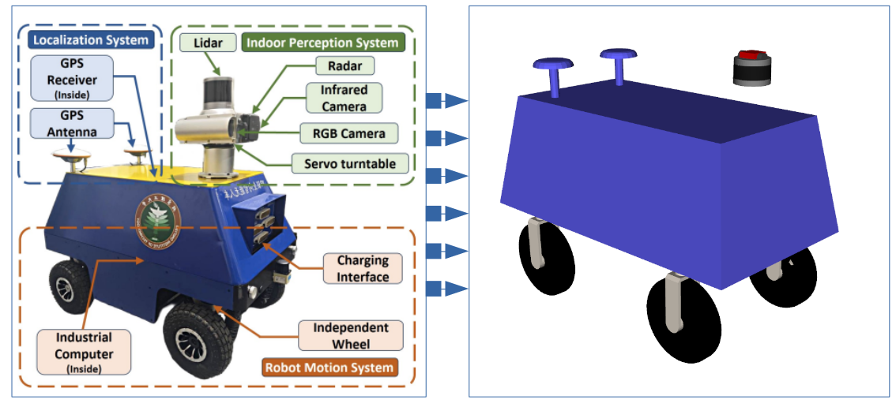
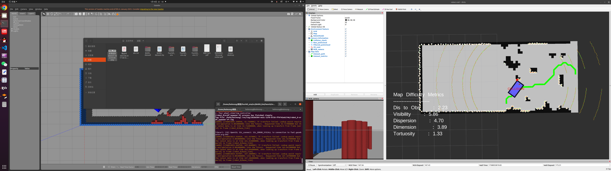

## 4WIS Robot Simulation Environment

> A comprehensive simulation environment established for 4WIS trajectory planning and control [Ubuntu 20.04 + ROS Noetic]

### Basic Functions

* A URDF model reconstructed based on a real 4WIS physical platform
* Integration of a 3D LiDAR, RGB camera, IMU, and collision sensors, with support for [3D point cloud to 2D laser scan conversion](https://github.com/ros-perception/pointcloud_to_laserscan/tree/1.4.1)
* Integration of map files from the [BARN dataset](https://www.cs.utexas.edu/~xiao/BARN/BARN.html) for building test environments
* Construction of multi-modal motion controllers, including both dynamic mode switching and enforced static mode switching. The inputs consist of discrete motion-mode selection and continuous control commands. The controller structure is designed to be compatible with the requirements of both [MIQP-based controllers](https://ieeexplore.ieee.org/document/10610461) and [DRL-based controllers](https://ieeexplore.ieee.org/document/11247526/) (to be completed)

### Prerequisites

> Since the environment has not been configured on a new machine recently, some dependencies may be missing. Feel free to report any missing prerequisites via issues.

```
sudo apt install ros-noetic-gazebo-ros-pkgs
sudo apt install ros-noetic-gazebo-ros-control
sudo apt install ros-noetic-xacro 
sudo apt install ros-noetic-robot-state-publisher 
sudo apt install ros-noetic-joint-state-publisher
sudo apt install ros-noetic-image-common 
sudo apt install ros-noetic-image-transport
sudo apt install ros-noetic-cv-bridge
sudo apt install ros-noetic-urdf-geometry-parser
sudo apt install ros-noetic-four-wheel-steering-msgs
```

### Package Description

* 4WIS_Robot: the main package for loading the simulation environment, including the robot model and sensors

<p align="center"></p>

* BARN: navigation environment dataset. Due to changes in the robot platform, the original paths and evaluation metrics are no longer applicable

<p align="center"></p>

* [four_wheel_steering_controller](https://github.com/ros-controls/ros_controllers/tree/noetic-devel/four_wheel_steering_controller): an existing 4WIS motion controller that does not support multi-modal motion
* 4WIS_Controller: a custom motion controller for the 4WIS robot (to be completed)

### Usage

```
# 1. Launch a clean robot platform and environment.
#    Sensor parameters and environment settings can be modified in the launch file
roslaunch 4WIS_Robot run.launch 

# 2. Launch the integrated BARN dataset environment directly [Step 1 is not required].
#    Control via joystick (left stick: forward motion, right stick: steering)
roslaunch BARN_Env run.launch
```

### Discussion and Notes

* There exists a grid-level offset along the Y-axis between the map and world files in the BARN dataset.
  This issue is handled in the world–map coordinate transformation node.

### References

If you find this environment useful for your research, please cite the following paper:

```
@INPROCEEDINGS{11247526,
author={Bao, Runjiao and Xu, Yongkang and Zhang, Lin and Yuan, Haoyu and Si, Jinge and Wang, Shoukun and Niu, Tianwei},
booktitle={2025 IEEE/RSJ International Conference on Intelligent Robots and Systems (IROS)}, 
title={Deep Reinforcement Learning-Based Trajectory Tracking Framework for 4WS Robots Considering Switch of Steering Modes}, 
year={2025},
pages={3792--3799},
doi={10.1109/IROS60139.2025.11247526}
}
```


<details>
<summary>点击查看中文版</summary>


## 4WIS 机器人仿真环境

> 为4WIS轨迹规划与控制所建立的综合仿真环境 [Ubuntu20.04+ROS Noetic]

### 基本功能

* 基于4WIS物理平台复刻的机器人URDF
* 集成了3D激光雷达、RGB相机、IMU、碰撞传感器，并融合了[3D点云转2Dscan](https://github.com/ros-perception/pointcloud_to_laserscan/tree/1.4.1)功能 
* 融合了[BARN数据集](https://www.cs.utexas.edu/~xiao/BARN/BARN.html)的地图文件，用于构建测试环境
* 构建多模态下的运动控制器，包含允许动态切换与强制静态切换两种。输入包括离散的模态选择与连续的控制量，其结构符合[混合整数二次规划MIQP Controller](https://ieeexplore.ieee.org/document/10610461)与[深度强化学习DRL Controller](https://ieeexplore.ieee.org/document/11247526/)两种常用方法的需求(待处理)


### 必要前置

> 由于我没有在新的电脑上配置过，前置可能有所遗漏，欢迎在issue中指出

```
sudo apt install ros-noetic-gazebo-ros-pkgs
sudo apt install ros-noetic-gazebo-ros-control
sudo apt install ros-noetic-xacro 
sudo apt install ros-noetic-robot-state-publisher 
sudo apt install ros-noetic-joint-state-publisher
sudo apt install ros-noetic-image-common 
sudo apt install ros-noetic-image-transport
sudo apt install ros-noetic-cv-bridge
sudo apt install ros-noetic-urdf-geometry-parser
sudo apt install ros-noetic-four-wheel-steering-msgs
```

### 功能包说明

* 4WIS_Robot: 加载环境的总功能包，包括机器人模型、传感器

<p align="center"></p>

* BARN：导航环境数据集;由于机器人平台变化，原本的路径与指标不再适用

<p align="center"></p>

* [four_wheel_steering_controller](https://github.com/ros-controls/ros_controllers/tree/noetic-devel/four_wheel_steering_controller)：现有的4WIS运动控制器，不支持多模态特性
* 4WIS_Controller: 4WIS机器人运动控制器（待处理）


### 使用说明

```
# 1. 启动纯净机器人平台与环境，传感器参数与环境可从launch中更改
roslaunch 4WIS_Robot run.launch 

# 2. 直接启动BARN数据集集成环境[无需启动1]，通过手柄进行操控（左摇杆前进，右摇杆转向）
runlaunch BARN_Env run.launch

```

### 讨论与记录

* BARN数据集的map和world有一个栅格的Y轴误差，在world和map的坐标变换节点中进行了处理


### 相关引用

If you find this environment useful for your research, please cite the following paper:
```
@INPROCEEDINGS{11247526,
author={Bao, Runjiao and Xu, Yongkang and Zhang, Lin and Yuan, Haoyu and Si, Jinge and Wang, Shoukun and Niu, Tianwei},
booktitle={2025 IEEE/RSJ International Conference on Intelligent Robots and Systems (IROS)}, 
title={Deep Reinforcement Learning-Based Trajectory Tracking Framework for 4WS Robots Considering Switch of Steering Modes}, 
year={2025},
pages={3792-3799},
doi={10.1109/IROS60139.2025.11247526}}
```

</details>
